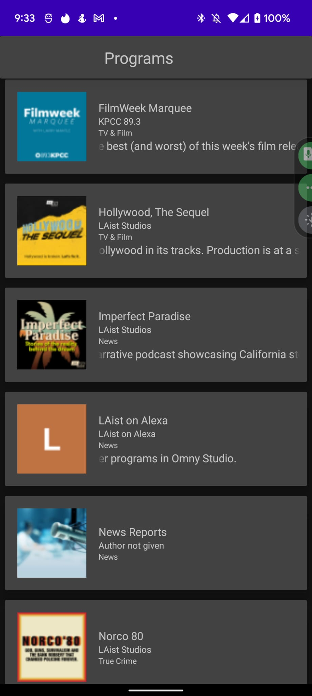
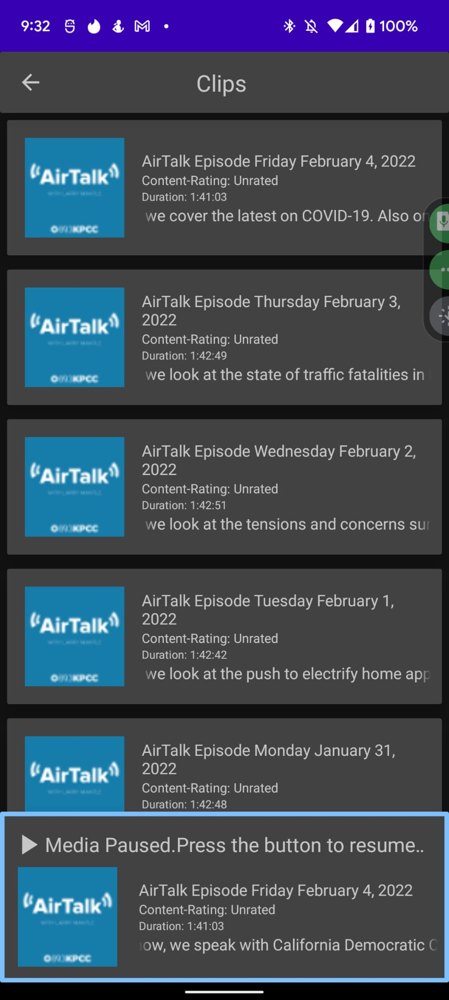

# SCPR - Android Kotlin Challenge (App to view on-demand programs/podcasts and audio clips)
### Task
- Create a simple Android app, written in Kotlin, that lists all programs associated with SCPR. Present this as a scrollable list.
- When a user taps a program from the list, display up to the most recent 50 clips associated with the tapped program. Present this as a scrollable list.
- When a user taps a clip, begin audio playback of the tapped clip. There should be some visual indication that audio is playing.
- Provide some affordance for a user to stop and/or pause audio, and tapping on a different clip should stop current playback and begin playing the selected clip instead.
 
### Constraints
- Please spend no more than **3 hours** on actual programming (extra time for reading API documentation or setting up your GitHub repository is fine).
- Get as much done as you can within the time allotted.

### Results
If I had more time, these are some of the additions and changes that I would make:
- Better themes and UI/UX design. 
- Comprehensive unit testing and fixing of some bugs in the app
- Ability to play music even if the app is not visible by using a foreground notification service.

### Screenshots
#### Screen : Program List

#### Screen : Clips - Preparing stream
- When you click on a clip, it is first async prepared before playing

#### Screen : Clips - Press to Pause
- When a clip is playing, press the pause button to pause

#### Screen : Clips - Press to resume playing
- When a clip is paused, press the resume button to resume playing
